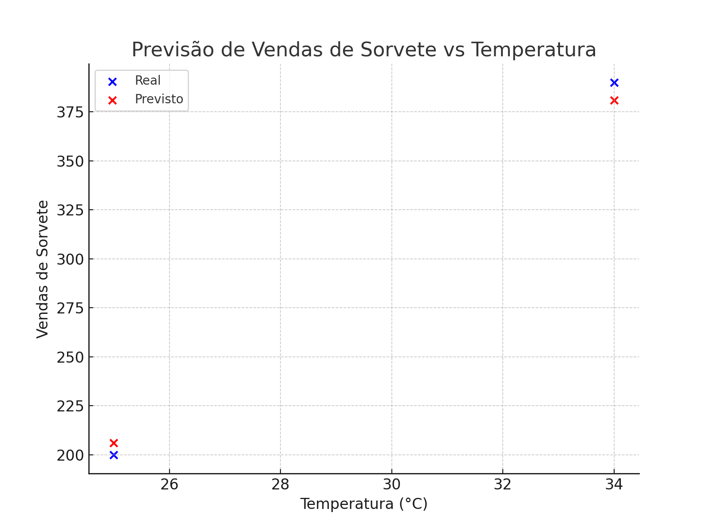

# sorvete-ml-predict
repositório inicial sobre Machine Learning

# Prevendo Vendas de Sorvete com Machine Learning 🍦📊

Este projeto utiliza Machine Learning para prever a quantidade de sorvetes vendidos com base na temperatura do dia. Ele segue um pipeline estruturado para garantir reprodutibilidade e gerenciamento eficiente do modelo.

## 📂 Estrutura do Projeto
```
/sorvete-ml-predict
│── inputs/
│   ├── dados.txt
│── grafico_exemplo.png
│── modelo.py
│── README.md
```

## 📊 Dataset Simulado
O arquivo `dados.txt` contém um conjunto de dados fictício com temperaturas e suas respectivas vendas:
```
Temperatura,Vendas
22,150
25,200
30,320
35,400
40,500
```

## 🚀 Execução do Modelo
O script `modelo.py`:
- Carrega os dados simulados.
- Divide os dados em treino e teste.
- Treina um modelo de regressão linear.
- Avalia o modelo com métricas como MAE, MSE e RMSE.
- Gera um gráfico de dispersão comparando valores reais e previstos.

## 🔍 Resultados Obtidos
Após o treinamento, o modelo apresentou os seguintes resultados:
- **Erro Absoluto Médio (MAE):** 7.53
- **Erro Quadrático Médio (MSE):** 58.86
- **Raiz do Erro Quadrático Médio (RMSE):** 7.67

### 📸 Gráfico de Previsão
Abaixo está um exemplo de saída gráfica do modelo:



## 🏆 Conclusão
Este projeto demonstra como é possível prever vendas de sorvete com base na temperatura, ajudando negócios a se planejarem melhor e reduzirem desperdícios.

Sinta-se à vontade para contribuir ou sugerir melhorias! 🚀

